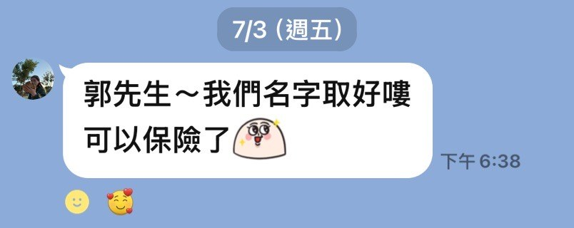

# 個人網站替換指南

這是一個參考 Canva 範例風格製作的單頁個人網站，主要檔案：

- `index.html`：修改名字、文案、服務項目、按鈕連結
- `styles.css`：修改顏色、字級、版面間距

建議替換順序：

1. 把 `郭品震`、`Pinzhen Guo` 換成你的正式名稱。
2. 把 hero 區塊的 `專業顧問 / 內容創作者 / 你的身分標籤` 換成你的身分。
3. 把 `assets/profile-guo-pinzhen.jpg` 換成你的個人形象照。
4. 把「關於我」「我可以協助你」「免費小禮物」換成你的真實服務內容。
5. 把 Email、Instagram、LINE 連結換成你的聯絡方式。
6. 客戶回饋跑馬燈可以把 `.feedback-placeholder` 換成真實圖片。

客戶回饋圖片範例：

```html
<figure class="feedback-card">
  
  <figcaption>客戶心得截圖</figcaption>
</figure>
```

搭配 CSS：

```css
.feedback-image {
  display: block;
  width: 100%;
  aspect-ratio: 4 / 3;
  object-fit: cover;
  border: 1px solid rgba(15, 22, 69, 0.16);
  border-radius: 8px;
}
```

如果要放照片，可以在 `index.html` 裡把這段：

```html
<div class="photo-placeholder">
  <span>放上你的</span>
  <strong>個人照</strong>
</div>
```

換成：

```html

```

再在 `styles.css` 加上：

```css
.profile-photo {
  width: min(82%, 420px);
  aspect-ratio: 4 / 5;
  object-fit: cover;
  object-position: center;
  border-radius: 8px 8px 0 0;
  border: 1px solid rgba(255, 255, 255, 0.5);
  border-bottom: 0;
}
```
